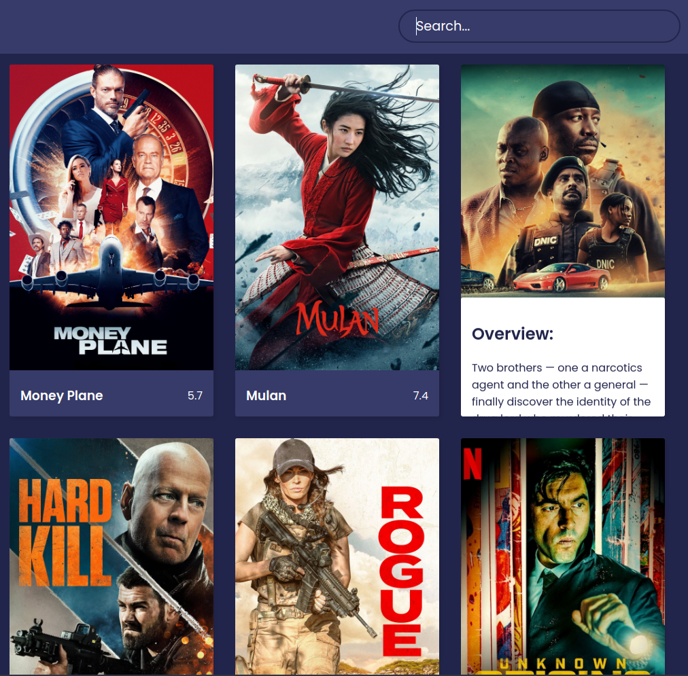

### Movies React App
<h1 align="center"> BINX </h1>



## API Stuff

- Features: https://api.themoviedb.org/3/discover/movie?sort_by=popularity.desc&api_key=<<your api>>
- Images: https://image.tmdb.org/t/p/w1280[/image.jpg]
- Search: https://api.themoviedb.org/3/search/movie?&api_key=<<your api>>

## How to setup locally

```sh
    npm i
    npm start
```
and then head over to https://localhost:3000

## Future Plans

Currently the App only shows the `Most Popular` movies, we plan to add `Where Can You Watch` feature and sorting abilities in the future.

Frontend is made with the help of [Florin pop's video](https://www.youtube.com/watch?v=sZ0bZGfg_m4)
