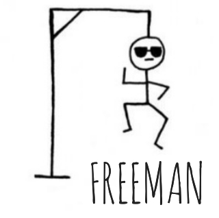

     

## FREEMAN

---

Wait what? Freeman?  
We've all played Hangman but what's Freeman?

In Freeman, we need to stop Chintu (sexist much?) from escaping. He's being hanged.

This game is based on hangman but its purpose is exactly opposite (Don't let him escape).  
This is a multiplayer/PVP game. Users will be given a jumbled word with a hint.

Jumbled words consist of a closed source software/technology and its open source alternative. (Yes, we've literally **combined opposites**)  
You'll be provided with hints which will let you know the domain of a pair of technology being given to you.

Head straight in -> [FREEMAN](https://ishan-saini.github.io/codejam-21/trendy-tacos/)

- **Rules**

  1. There are 3 rounds, the player with the highest score will win in the end.
  2. With each wrong guess one part of the stand will dissapear and you'll be helping Chintu escape. That means you only 4 chances.
  3. If you exhaust all of your 4 chances, the other player will win regardless. (This feature might get removed in future if it doesn't work out well)
  4. Any letter that isn't present in the jumbled word would still be considered a wrong guess.
  5. Use Keyboard keys for input and mouse for interacting with buttons.

TODO -
While this project was created under a coding event, We'd still be working on it after the event. Some functionalities we might add - 1. Timer for each turn. 2. Avoid repeating of words 3. Remote connection using socket.io
